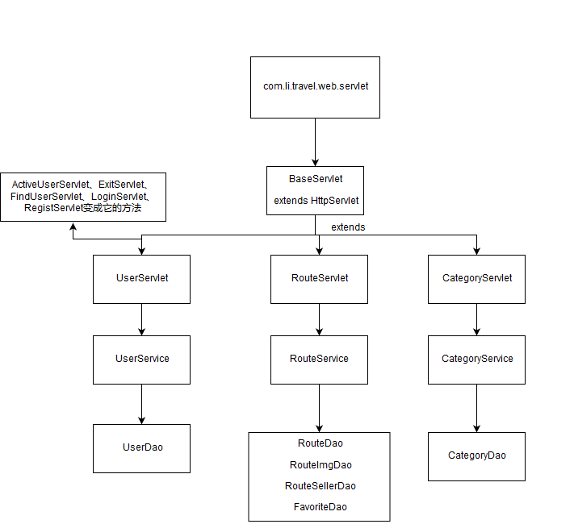

# 技术选型

1、Web层

	a） Servlet：前端控制器
	
	b） html	视图
	
	c）Filter	过滤
	
	d）BeanUtils	数据封装
	
	e）Jackson	json序列化工具

2、Service层

	a）javamail
	
	b）Redis	缓存
	
	c）Jedis		操作redis

3、Dao层

	a） MySql
	
	b）Druid
	
	c）JdbcTemplate
# 结构

# 注意

* 在注册信息提交后，由于给提交邮箱发送激活邮件后，页面跳转，所以跳转时间会有点长。

  

